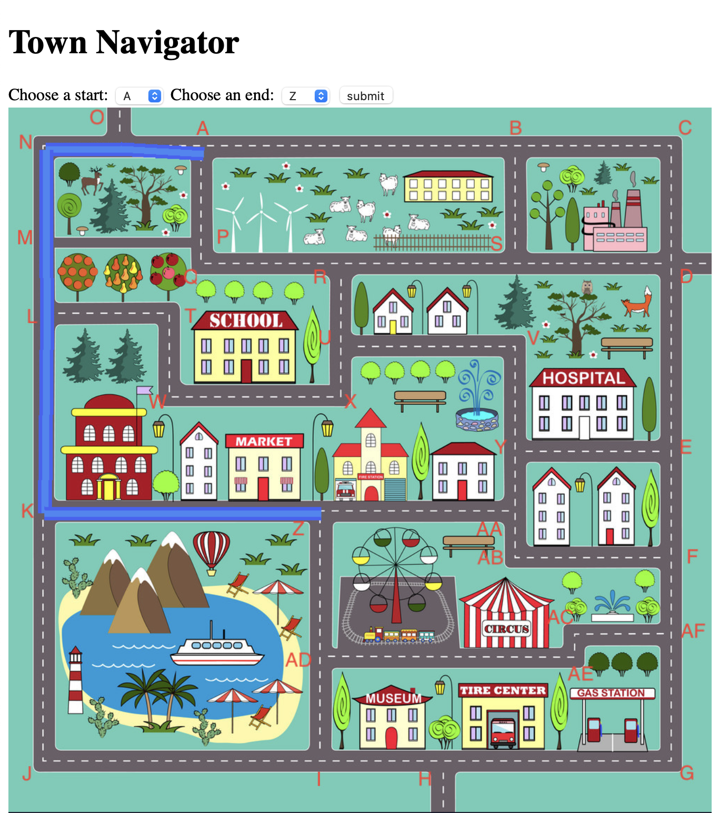

# Flask App
A sample flask server that has a couple pages:
1. Index that has a form to send a post request to my API
    - This index has dropdown options populated by lists passed to the render_template method.
2. An API endpoint that returns a sentance containing the values passed to it in the POST request form
3. A mapping system, that draws a map onto an image and returns this in a response
4. Interactive mapping page with javascript to reload the new map image

# CSV to ADJ list
Python program to take in a CSV and output an adjacency list in a dictionary of dictionaries data structure.
